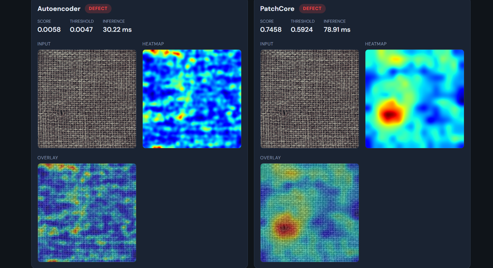
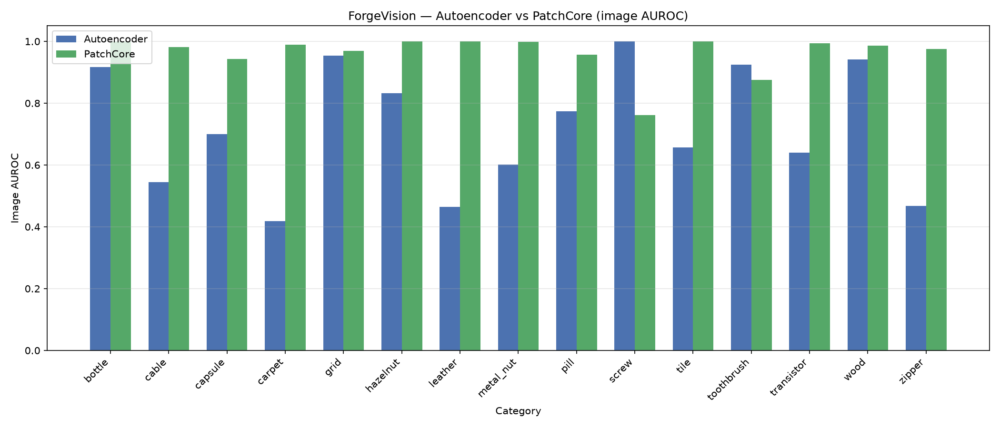

# ForgeVision

A modular 2D computer-vision platform for industrial quality inspection — anomaly detection today; defect classification and object detection planned as drop-in modules.



*Live browser demo, same defect, two methods. The autoencoder flags that something is wrong but smears error across the weave; PatchCore localizes the actual defect as a tight red blob on a blue background.*

---

## Overview

ForgeVision trains **only on defect-free images** — the realistic industrial setting where defects are rare and impractical to label at scale. Two anomaly-detection methods are implemented **from scratch** (no `anomalib`):

- **Convolutional autoencoder** — reconstruction-error baseline
- **PatchCore** — memory-bank method (Roth et al., 2022), state of the art on MVTec AD

The platform is benchmarked on all **15 MVTec AD** categories (one model per category), served through a **FastAPI + React** UI, and **Dockerized** for one-command deployment.

---

## Results

**Headline:** mean image AUROC **0.722 → 0.962** (autoencoder → PatchCore); mean pixel AUROC **0.837 → 0.948**.



| Category | AE image | PatchCore image | AE pixel | PatchCore pixel |
|----------|----------|-----------------|----------|-----------------|
| bottle | 0.917 | 1.000 | 0.837 | 0.986 |
| cable | 0.544 | 0.982 | 0.614 | 0.966 |
| capsule | 0.700 | 0.943 | 0.826 | 0.946 |
| carpet | 0.418 | 0.989 | 0.802 | 0.990 |
| grid | 0.954 | 0.969 | 0.958 | 0.978 |
| hazelnut | 0.833 | 1.000 | 0.979 | 0.987 |
| leather | 0.465 | 1.000 | 0.988 | 0.993 |
| metal_nut | 0.602 | 0.999 | 0.790 | 0.948 |
| pill | 0.774 | 0.957 | 0.924 | 0.943 |
| screw | 1.000 | 0.762 | 0.966 | 0.736 |
| tile | 0.657 | 1.000 | 0.579 | 0.957 |
| toothbrush | 0.925 | 0.875 | 0.925 | 0.975 |
| transistor | 0.640 | 0.994 | 0.713 | 0.915 |
| wood | 0.942 | 0.986 | 0.829 | 0.946 |
| zipper | 0.467 | 0.976 | 0.822 | 0.956 |
| **Mean** | **0.722** | **0.962** | **0.837** | **0.948** |

*Source: `eval/results.csv` + `eval/results_patchcore.csv` (full delta table in `eval/comparison.md`).*

### Honest findings

**Textures leap the most** because PatchCore compares patch embeddings to a bank of normal patches instead of trying to reconstruct repetitive structure. The autoencoder often reconstructs textures poorly and smears error everywhere; PatchCore only fires where a patch is genuinely unlike anything in memory.

| Category | AE → PatchCore (image) | Why |
|----------|------------------------|-----|
| carpet | 0.42 → 0.99 | Strongest gain — weave reconstruction fails; patch NN localizes |
| leather | 0.46 → 1.00 | Same pattern — texture vs feature comparison |
| tile | 0.66 → 1.00 | Structured surface; AE smears, PatchCore pins the defect |

**Screw and toothbrush regress** on image AUROC (screw 1.00 → 0.76; toothbrush 0.93 → 0.88). This is worth reporting, not hiding. Screw images have **high pose variation** (rotation, thread angle); with aggressive **1% coreset subsampling** (chosen to fit 8 GB VRAM), the memory bank may miss rare normal modes, so some good images look farther from their nearest neighbor than expected. Raising `coreset_ratio` (e.g. 0.05) typically recovers screw performance — a documented trade-off, not a fundamental flaw. Pixel AUROC on screw drops similarly, consistent with the subsampling story rather than a scoring bug.

---

## How it works

**Autoencoder:** Learn to reconstruct normal images. At test time, flag pixels (and images) with high reconstruction error. Simple and fast, but on textures the model often cannot reconstruct the whole field cleanly — error smears across the object, not just the defect.

**PatchCore:** Embed each image patch with a frozen pretrained WideResNet-50. Store a coreset-subsampled memory bank of normal patches from training. At test time, flag patches whose nearest neighbor in the bank is far away — anomalies are *different*, not *hard to reconstruct*. Localizes precisely; costs more compute and memory tuning.

---

## Heatmaps (API)

Heatmap **color** uses per-image **percentile scaling** (see `forgevision/core/heatmap.py`): typical patch scores anchor at the **60th percentile** (blue/green background), and only the **99th percentile and above** saturate to red. That adapts to each category’s absolute score scale — uniform textures (carpet) and noisy objects (pill, capsule) both show a cool field with a localized hot spot on the defect.

The **PASS/DEFECT badge** is separate: it still uses the calibrated decision threshold (`score >= threshold`). Percentile mapping affects colormap only, not scoring or verdicts.

Thresholds are fit from `train/good/` scores (`mean + 3σ`, k=3) and stored in `eval/thresholds.json`. Precompute all categories offline before Docker build (see Run it below) — the API reads the file; it does not calibrate on first request.

---

## Run it

### Primary — Docker

Requires trained weights in `models/` locally (not in git). Build context includes them via `.dockerignore` exception.

```powershell
docker compose up --build
```

| URL | Service |
|-----|---------|
| **http://localhost:8080** | React UI |
| http://localhost:8000/docs | FastAPI (OpenAPI) |
| http://localhost:8000/health | Health check |

**CPU-only by default** (PyTorch CPU wheel). For GPU inference, swap the CUDA torch line in `api/Dockerfile` and run:

```powershell
docker compose -f docker-compose.yml -f docker-compose.gpu.yml up --build
```

### Alternative — local dev

```powershell
cd forgevision
.\.venv\Scripts\Activate.ps1
pip install -r requirements.txt
pip install -r api/requirements.txt

# Terminal 1
uvicorn api.main:app --reload --host 127.0.0.1 --port 8000

# Terminal 2
cd ui && npm install && npm run dev
```

UI: **http://127.0.0.1:5173** · API: **http://127.0.0.1:8000**

### Dataset and weights (not in repo)

1. Download [MVTec AD](https://www.mvtec.com/company/research/datasets/mvtec-ad) manually (see License below).
2. Unzip under `data/mvtec_ad/<category>/` with `train/good/`, `test/`, `ground_truth/`.
3. Train per category:

```powershell
python scripts/run_all.py --method autoencoder --epochs 50
python scripts/run_all.py --method patchcore
```

Weights land in `models/`; evaluation tables in `eval/`.

4. Precompute decision thresholds for every trained category × method (required for Docker — bakes `eval/thresholds.json` into the image):

```powershell
python scripts/compute_thresholds.py --overwrite
```

Uses the same calibration logic as the API (`api/thresholds.py`); expect ~30 entries (15 categories × autoencoder + patchcore) when all weights exist.

### Use as a library

ForgeVision is pip-installable; other projects can add it as a dependency (editable locally or from a git/path URL).

```powershell
pip install -e .
```

```python
import torch
from forgevision.config import RunConfig
from forgevision.core.factory import create_method

cfg = RunConfig(category="bottle", method="patchcore")
method = create_method(cfg)
method.load(cfg.models_dir / "bottle_patchcore.pth")

image_tensor = torch.rand(1, 3, cfg.image_size, cfg.image_size)  # (B, 3, H, W) in [0, 1]
image_scores, anomaly_maps = method.score(image_tensor)
```

Library dependencies are declared in `pyproject.toml` (ML stack only). API/UI extras stay in `requirements.txt` and `api/requirements.txt`.

---

## Architecture

ForgeVision separates **platform** from **methods**:

```
core/          Shared dataset, metrics, visualization, orchestration
               AnomalyMethod interface: fit() · score() · save() · load()

methods/       autoencoder/   Conv AE + reconstruction scoring
               patchcore/     WideResNet50 features + coreset memory bank

api/           FastAPI — thin serving layer over AnomalyMethod
ui/            React + Vite — upload, compare, heatmaps
scripts/       run_train.py · run_eval.py · run_all.py
```

The API and multi-category orchestrator call **only** the `AnomalyMethod` interface — no method-specific branches beyond construction. Adding a new detector = implement the interface in `methods/yourmethod/`, register in `core/factory.py`, train with `--method yourmethod`.

**Phase journey:** conv-autoencoder baseline → modular refactor + PatchCore + head-to-head eval → FastAPI + React UI → Docker + percentile-based heatmaps.

### Limitations & next steps

- **Per-category models today** — the UI requires selecting the product type (e.g. carpet, bottle). Auto-category routing is on the roadmap.
- **Defect classification and object detection** — planned as drop-in modules on the same `AnomalyMethod` / platform interface; anomaly detection is the first shipped capability.
- **Screw PatchCore regression** — recoverable by raising `coreset_ratio` (VRAM trade-off); the 1% default prioritizes 8 GB deployment over peak score on high-pose categories.
- **Production hardening** — threshold calibration per line, model versioning, and batch inference are natural extensions of the existing API and Docker stack.

---

## Project structure

```
├── pyproject.toml         # pip install -e .
├── docker-compose.yml
├── docker-compose.gpu.yml
├── forgevision/           # pip-installable library
│   ├── config.py
│   ├── core/              # AnomalyMethod ABC, dataset, metrics, runner, …
│   └── methods/           # autoencoder/, patchcore/
├── api/
├── ui/
├── scripts/
├── models/                # gitignored — trained weights
├── data/                  # gitignored — MVTec AD
└── eval/                  # metrics, comparison tables, plots
```

---

## License and data

**MVTec AD** is licensed under [CC BY-NC-SA 4.0](https://creativecommons.org/licenses/by-nc-sa/4.0/) — **non-commercial use only**. Dataset images and trained weights are **not redistributed** in this repository.

ForgeVision source code is released under the MIT License (see LICENSE).
